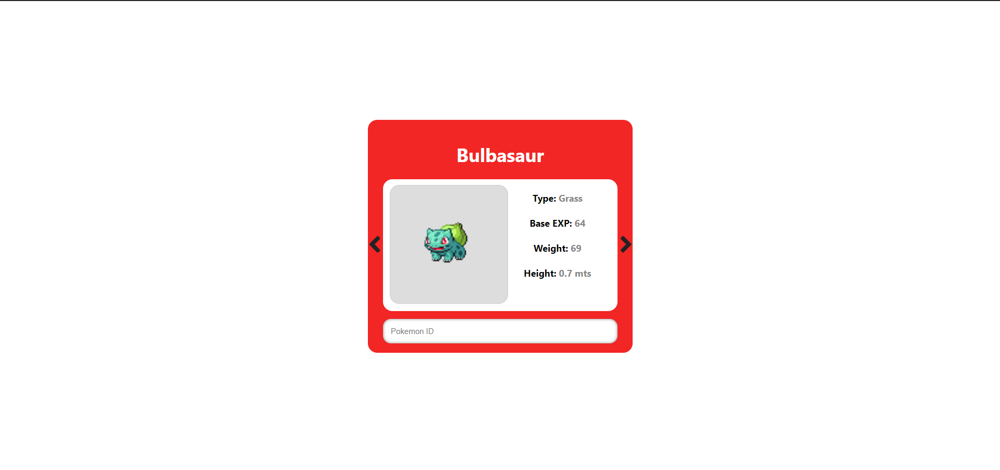

# Pokedex App

This is a simple application made in javascript, in which we obtain all the pokemons from an external API and we show them in the UI by entering a corresponding id, we can also go back and forth in the list of pokemons.

Principles Features: 
 - Requests to an API through Fetch.
 - Async Await promises.

Demo: [Pokedex](https://tonygll.github.io/pokedex-app/)

External API: [Pokeapi](https://pokeapi.co/)

**Screenshot:**
;
